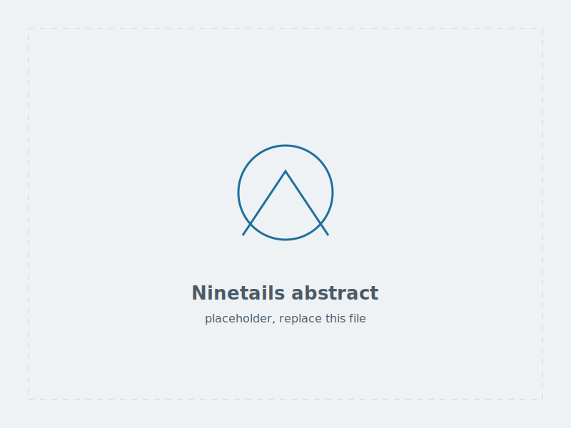
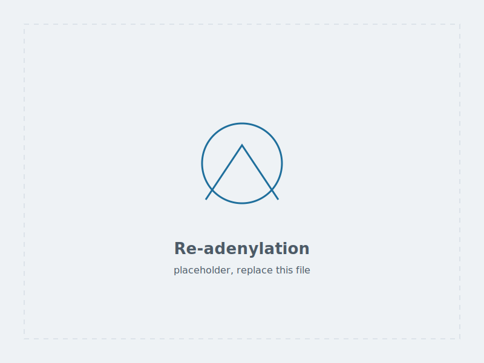
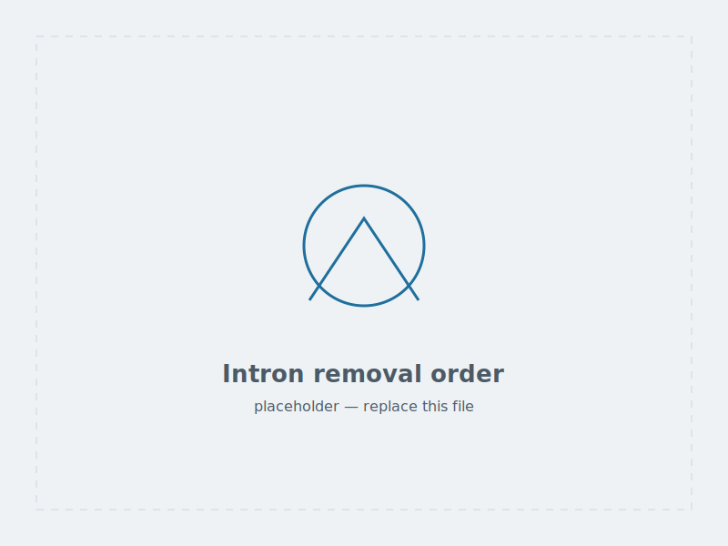
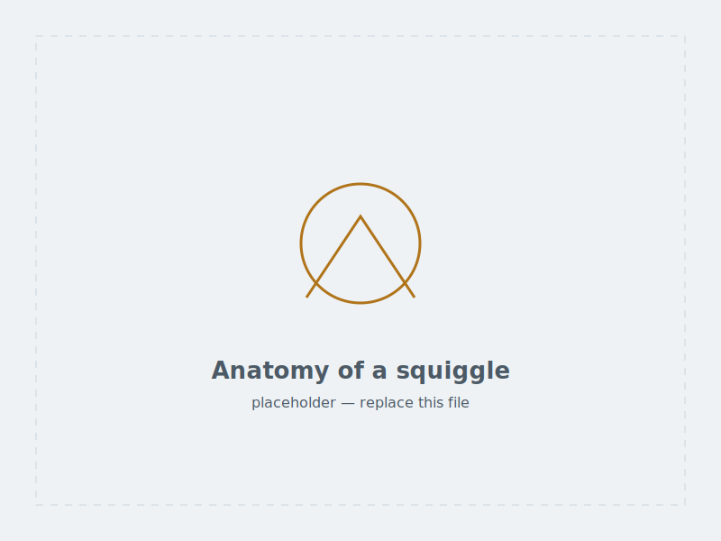
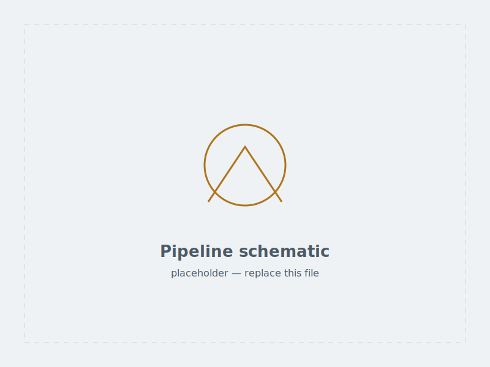
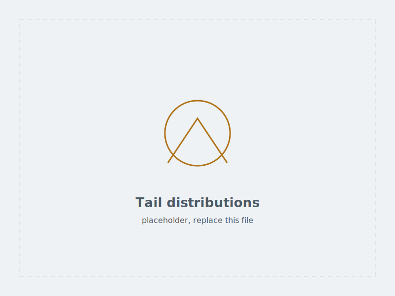
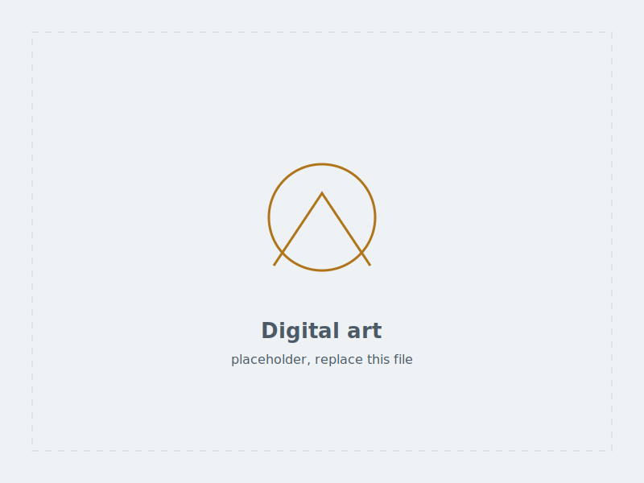

::: {.lead .reveal}
Figures for papers and talks, and the drawing they came out of. I try to make
figures that show the result clearly before the caption has to explain it. Click
any image for a larger view.
:::

## Graphical abstracts

```{=html}
<!-- Gallery markup, once, for reference:
       <a class="gallery-item" data-lightbox href="FULL.png" data-caption="Caption">
         
         <figcaption>
           <span class="g-title">Title</span>
           <span class="g-meta">Context · year</span>
         </figcaption>
       </a>
     `href` is the full-size image, `src` the thumbnail; they may be the same
     file. `alt` describes the content for screen readers and must not repeat
     the title. Always set width/height so the layout does not shift while
     images load. -->

<div class="gallery reveal">

  <a class="gallery-item" data-lightbox href="../assets/img/illustrations/abstract-ninetails.svg"
     data-caption="Ninetails: signal segmentation to classified tail composition.">
    
    <figcaption>
      <span class="g-title">Ninetails, graphical abstract</span>
      <span class="g-meta">Nature Communications · 2025</span>
    </figcaption>
  </a>

  <a class="gallery-item" data-lightbox href="../assets/img/illustrations/abstract-tailing.svg"
     data-caption="Cytoplasmic re-adenylation and its effect on transcript lifetime.">
    
    <figcaption>
      <span class="g-title">Re-adenylation</span>
      <span class="g-meta">Graphical abstract · 2025</span>
    </figcaption>
  </a>

  <a class="gallery-item" data-lightbox href="../assets/img/illustrations/abstract-euglena.svg"
     data-caption="Conventional and nonconventional intron removal order in Euglena gracilis.">
    
    <figcaption>
      <span class="g-title">Intron removal order</span>
      <span class="g-meta">PLOS Genetics · 2018</span>
    </figcaption>
  </a>

</div>
```

## Visual identity

::: {.card-grid}
::: {.u-card .reveal .d1}
### DEGRONOPEDIA <span class="status-badge status-active">live</span>
Graphical identity for **[DEGRONOPEDIA](https://degronopedia.com/){target="_blank"}**,
a web server for degrons, the short sequence motifs that mark a protein for
destruction by the ubiquitin–proteasome system. Built by the Pokrzywa Lab
(Laboratory of Protein Metabolism) at IIMCB, it searches degrons across eleven
model proteomes and predicts terminal stability.

The work had to stay readable for people arriving without any background in
degrons, and hold together across the database, the documentation and the
tutorial.

::: {.tag-row}
[Visual identity]{.pill} [Web server]{.pill} [Proteostasis]{.pill}
:::

[Visit DEGRONOPEDIA](https://degronopedia.com/){.btn-ghost target="_blank"}
:::
:::

::: {.highlight-box .reveal}
**To show the work rather than describe it,** add screenshots or the mark itself
to `assets/img/illustrations/` and give this section a gallery block like the
ones above. Check first whether the lab is happy for the assets to appear here.
:::

## Figures and schematics

```{=html}
<div class="gallery reveal">

  <a class="gallery-item" data-lightbox href="../assets/img/illustrations/figure-squiggle.svg"
     data-caption="Annotated nanopore current trace across an adapter, tail and transcript body.">
    
    <figcaption>
      <span class="g-title">Anatomy of a squiggle</span>
      <span class="g-meta">Teaching figure</span>
    </figcaption>
  </a>

  <a class="gallery-item" data-lightbox href="../assets/img/illustrations/figure-pipeline.svg"
     data-caption="Analysis pipeline from POD5 through basecalling to tail composition.">
    
    <figcaption>
      <span class="g-title">Pipeline schematic</span>
      <span class="g-meta">Workshop material · 2024</span>
    </figcaption>
  </a>

  <a class="gallery-item" data-lightbox href="../assets/img/illustrations/figure-distributions.svg"
     data-caption="Poly(A) length distributions compared across conditions.">
    
    <figcaption>
      <span class="g-title">Tail length distributions</span>
      <span class="g-meta">ggplot2</span>
    </figcaption>
  </a>

</div>
```

## Digital art

Personal work: fantasy, character studies, and the occasional creature with
questionable anatomy.

```{=html}
<div class="gallery reveal">

  <a class="gallery-item" data-lightbox href="../assets/img/illustrations/art-01.svg"
     data-caption="Personal work.">
    
    <figcaption>
      <span class="g-title">Untitled</span>
      <span class="g-meta">Digital · personal work</span>
    </figcaption>
  </a>

  <a class="gallery-item" data-lightbox href="../assets/img/illustrations/art-02.svg"
     data-caption="Personal work.">
    
    <figcaption>
      <span class="g-title">Untitled</span>
      <span class="g-meta">Digital · personal work</span>
    </figcaption>
  </a>

  <a class="gallery-item" data-lightbox href="../assets/img/illustrations/art-03.svg"
     data-caption="Personal work.">
    
    <figcaption>
      <span class="g-title">Untitled</span>
      <span class="g-meta">Digital · personal work</span>
    </figcaption>
  </a>

</div>
```

::: {.highlight-box .reveal}
**Every image on this page is a generated placeholder.** Drop your own files into
`assets/img/illustrations/` and update the `src`, `href`, `alt` and caption in
this file. Raster work is best exported at roughly 1600 px on the long edge as
WebP or optimised PNG; keep vector work as SVG.
:::

## Commissions and collaboration

::: {.highlight-box .reveal}
I make figures for the laboratory's papers and sometimes for collaborators. If
you need a schematic or a graphical abstract, [get in touch](../contact.qmd).
:::
