::: {.lead .reveal}
Figures for papers, press and teaching, and the drawing they came out of. Click
any image for a larger view.
:::

## Scientific figures

```{=html}
<div class="gallery reveal">

  <a class="gallery-item" data-lightbox href="../assets/img/illustrations/abstract-ltp-brain.png"
     data-caption="Dentate gyrus and synaptoneurosome samples taken at defined timepoints after stimulation, sequenced on Oxford Nanopore and analysed for differential expression, poly(A) site usage, tail length dynamics and non-adenosine residues.">
    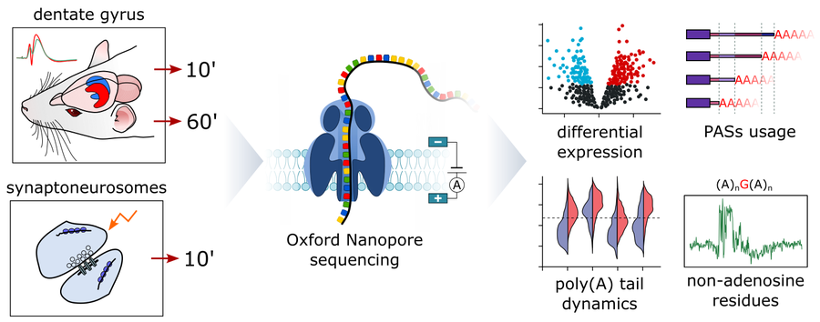
    <figcaption>
      <span class="g-title">Polyadenylation after long-term potentiation</span>
      <span class="g-meta">Graphical abstract</span>
    </figcaption>
  </a>

  <a class="gallery-item" data-lightbox href="../assets/img/illustrations/fig-ninetails-pipeline.png"
     data-caption="From basecalled signal and tail coordinates through segmentation, conversion to Gramian angular fields, and convolutional classification into (A)n, (A)nG(A)n, (A)nC(A)n and (A)nU(A)n.">
    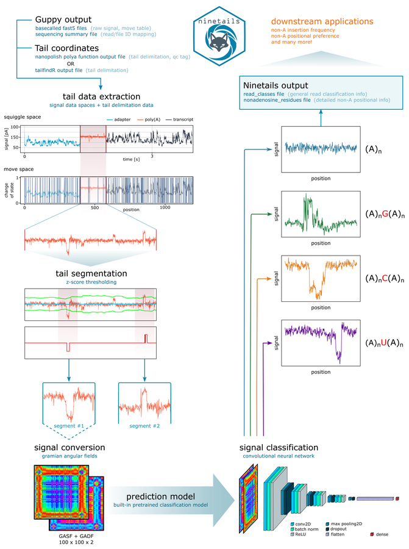
    <figcaption>
      <span class="g-title">ninetails, method overview</span>
      <span class="g-meta">Nature Communications, 2025</span>
    </figcaption>
  </a>

  <a class="gallery-item" data-lightbox href="../assets/img/illustrations/fig-arabidopsis.png"
     data-caption="The cleavage and polyadenylation complex with the factors mutated in the study marked, the genotypes analysed, and the direct RNA sequencing workflow from extraction to downstream analysis.">
    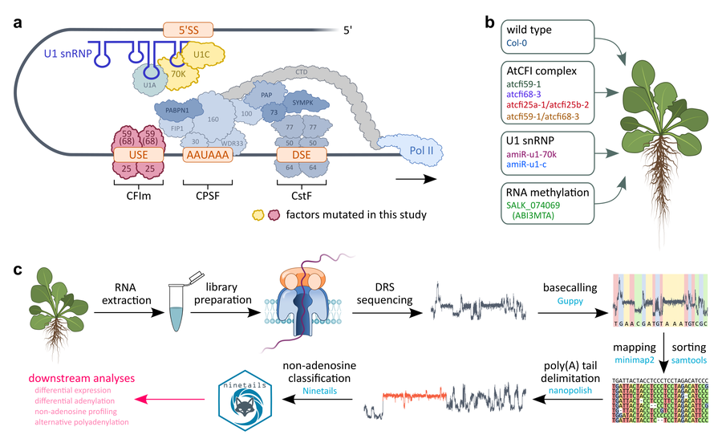
    <figcaption>
      <span class="g-title">Polyadenylation machinery and sequencing workflow</span>
      <span class="g-meta">Arabidopsis thaliana</span>
    </figcaption>
  </a>

  <a class="gallery-item" data-lightbox href="../assets/img/illustrations/abstract-rna-metabolism.png"
     data-caption="An mRNA passing through a nanopore, with TENT5 extending the poly(A) tail and MOV10 and TUT7 driving uridylation at the opposite fate.">
    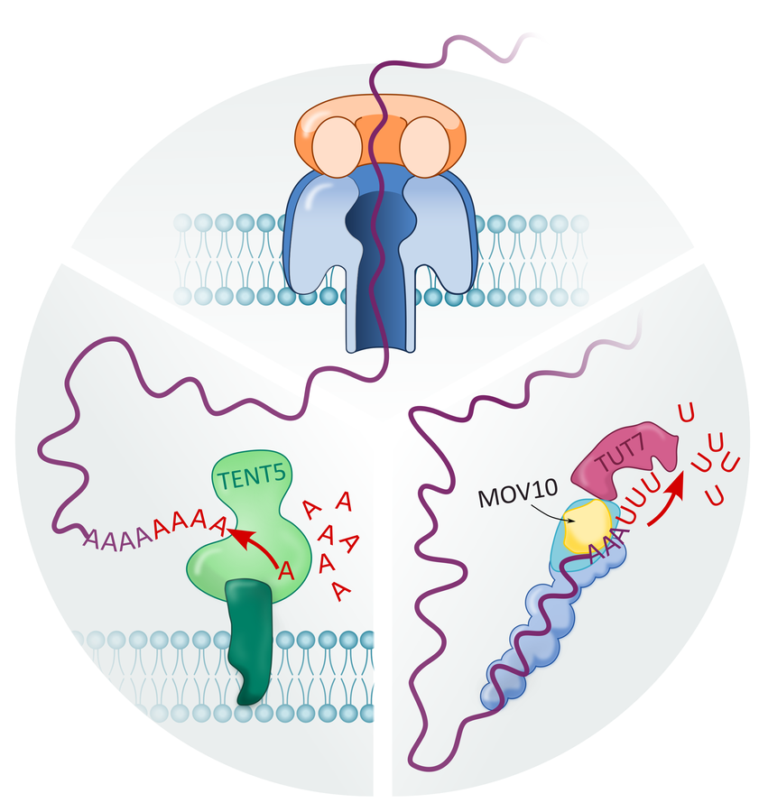
    <figcaption>
      <span class="g-title">Cytoplasmic control of the poly(A) tail</span>
      <span class="g-meta">Laboratory of RNA Biology</span>
    </figcaption>
  </a>

  <a class="gallery-item" data-lightbox href="../assets/img/illustrations/press-viverna.jpg"
     data-caption="Press illustration for the ViveRNA project, Principles of endogenous and therapeutic mRNA turnover in vivo, led by Andrzej Dziembowski at IIMCB. Published by the European Research Council in its Advanced Grants 2022 announcement.">
    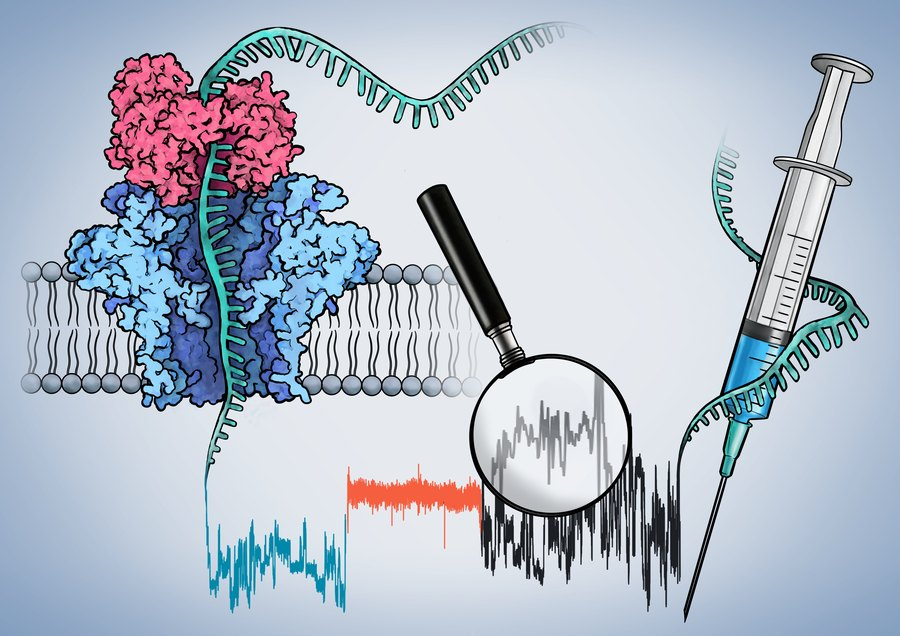
    <figcaption>
      <span class="g-title">ViveRNA</span>
      <span class="g-meta">ERC Advanced Grant, 2023</span>
    </figcaption>
  </a>

</div>
```

## Data visualisation

```{=html}
<div class="gallery reveal">

  <a class="gallery-item" data-lightbox href="../assets/img/illustrations/eda-oscars-basic.png"
     data-caption="Most competitive categories, win to nomination ratio, most awarded films, studios, countries and composers.">
    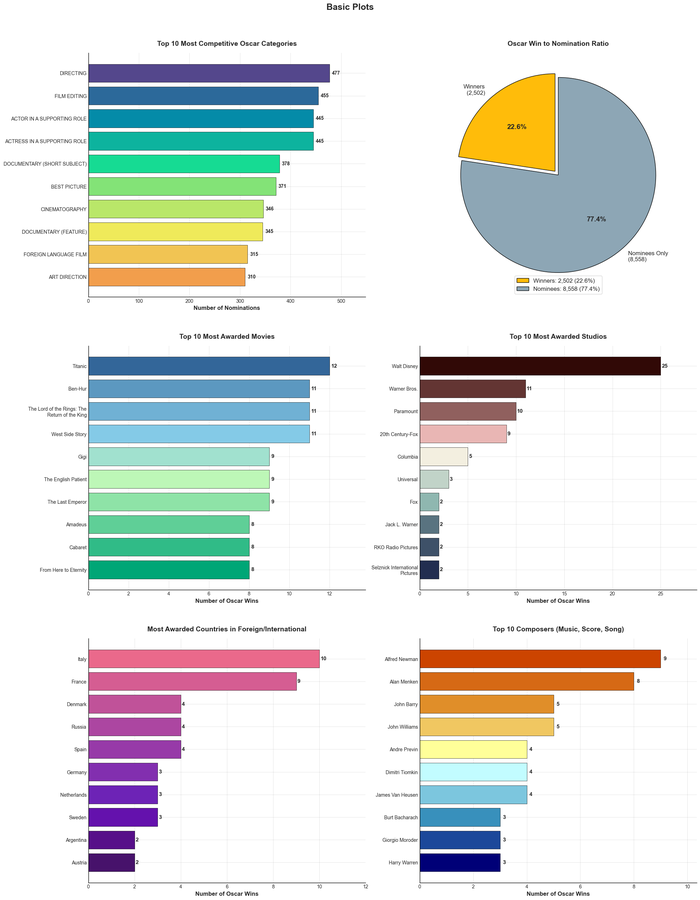
    <figcaption>
      <span class="g-title">Academy Awards, overview</span>
      <span class="g-meta">Postgraduate project</span>
    </figcaption>
  </a>

  <a class="gallery-item" data-lightbox href="../assets/img/illustrations/eda-oscars-timeline.png"
     data-caption="Annual nominations against awards given since 1929, with era boundaries marked, and activity aggregated by decade.">
    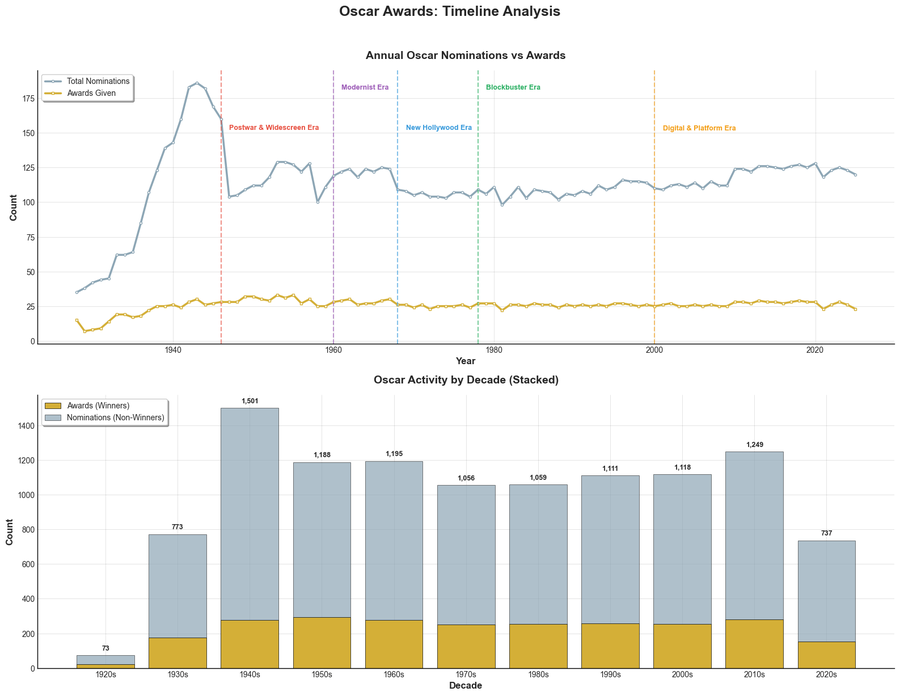
    <figcaption>
      <span class="g-title">Academy Awards, timeline</span>
      <span class="g-meta">Postgraduate project</span>
    </figcaption>
  </a>

  <a class="gallery-item" data-lightbox href="../assets/img/illustrations/eda-oscars-eras.png"
     data-caption="Nominations split across six eras of cinema, with category composition, win ratios and the most awarded performers in each.">
    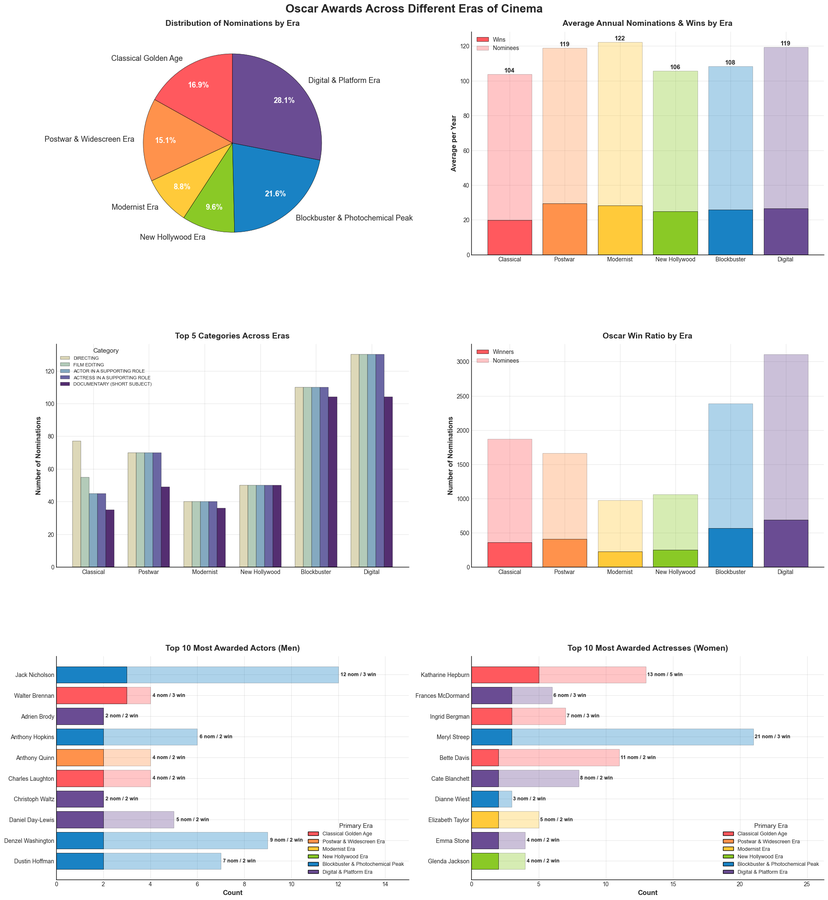
    <figcaption>
      <span class="g-title">Academy Awards, by era</span>
      <span class="g-meta">Postgraduate project</span>
    </figcaption>
  </a>

</div>
```

## Digital art

More of this, and the science drawing behind it, on my Facebook page
[Biorysunki](https://www.facebook.com/biorysunki).

```{=html}
<div class="gallery reveal">

  <a class="gallery-item" data-lightbox href="../assets/img/illustrations/art-warrior.jpg"
     data-caption="Character study, fantasy.">
    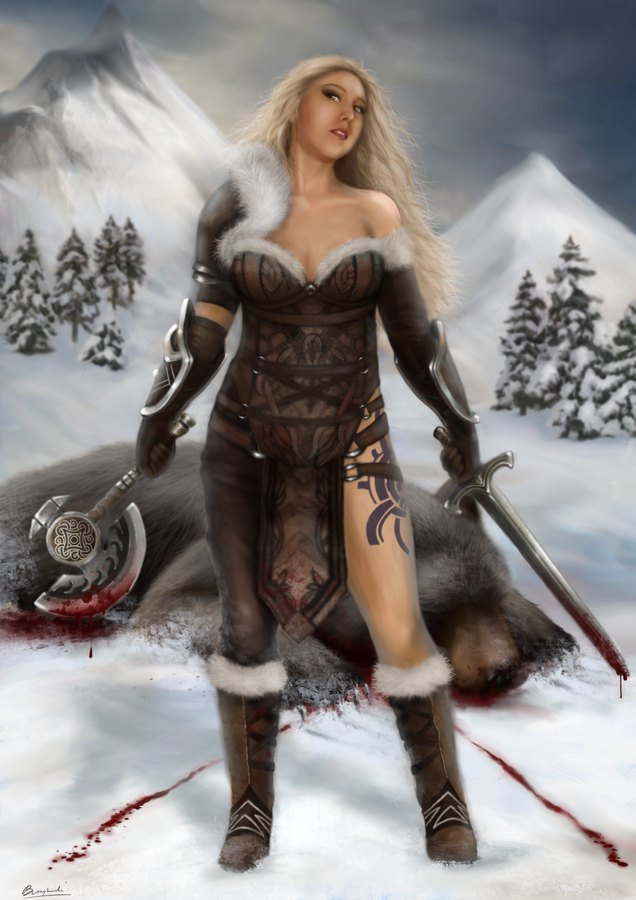
    <figcaption>
      <span class="g-title">Winter hunt</span>
      <span class="g-meta">Digital painting</span>
    </figcaption>
  </a>

  <a class="gallery-item" data-lightbox href="../assets/img/illustrations/art-forest.jpg"
     data-caption="Landscape study.">
    
    <figcaption>
      <span class="g-title">Light through the canopy</span>
      <span class="g-meta">Digital painting</span>
    </figcaption>
  </a>

  <a class="gallery-item" data-lightbox href="../assets/img/illustrations/art-guinea-pigs.jpg"
     data-caption="Animal study.">
    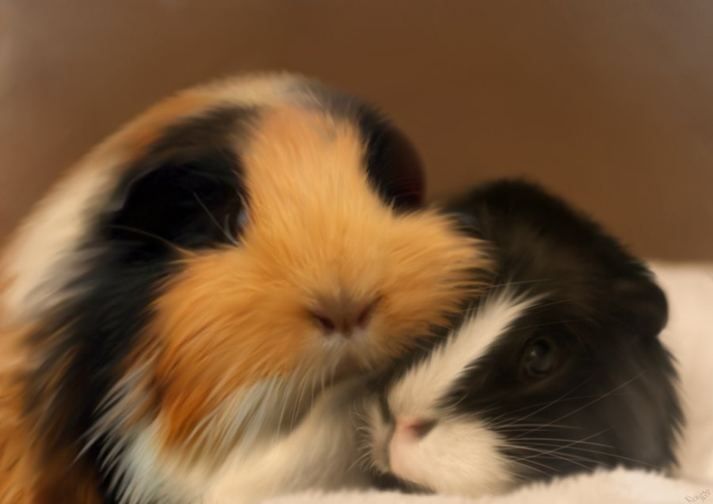
    <figcaption>
      <span class="g-title">Two guinea pigs</span>
      <span class="g-meta">Digital painting</span>
    </figcaption>
  </a>

  <a class="gallery-item" data-lightbox href="../assets/img/illustrations/art-chinchilla.jpg"
     data-caption="A chinchilla investigating a phone camera, and the photograph it is producing.">
    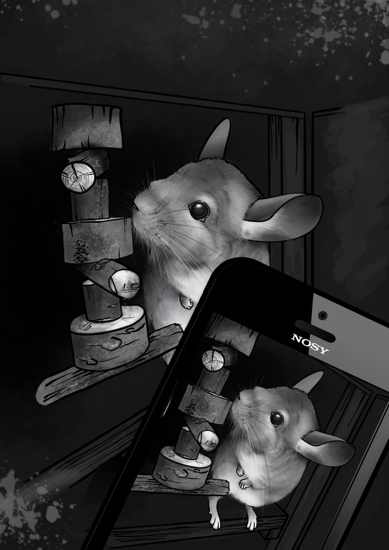
    <figcaption>
      <span class="g-title">Nosy</span>
      <span class="g-meta">Digital illustration</span>
    </figcaption>
  </a>

  <a class="gallery-item" data-lightbox href="../assets/img/illustrations/outreach-girls-rna.jpg"
     data-caption="Portraits of RNA researchers above two children building a strand from lettered blocks.">
    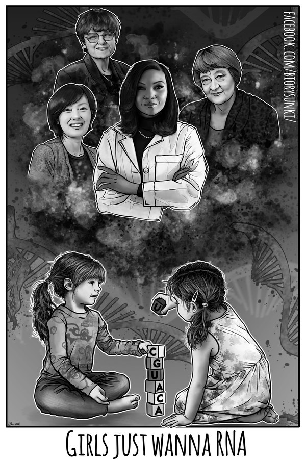
    <figcaption>
      <span class="g-title">Girls just wanna RNA</span>
      <span class="g-meta">Digital illustration</span>
    </figcaption>
  </a>

</div>
```

## Visual identity

```{=html}
<div class="identity reveal">
  
  <div class="identity-body">
    <h3 class="sw-name">DEGRONOPEDIA <span class="status-badge status-active">live</span></h3>
    <p class="sw-desc">I prepared the visual identification of
    <a href="https://degronopedia.com/" target="_blank">DEGRONOPEDIA</a>, a web
    server for proteome-wide inspection of degrons, built by the Pokrzywa Lab
    (Laboratory of Protein Metabolism) at IIMCB.</p>
    <p class="sw-meta">Acknowledged in Szulc et al., <em>Nucleic Acids
    Research</em> 52(W1), 2024</p>
    <p class="sw-links">
      <a class="btn-ghost" href="https://degronopedia.com/" target="_blank">Visit the server</a>
      <a class="btn-ghost" href="https://doi.org/10.1093/nar/gkae238" target="_blank">Paper</a>
    </p>
  </div>
</div>
```

## Tools

Inkscape, Krita, PaintTool SAI, Adobe Illustrator, and ggplot2 for anything
data-driven.

## Commissions and collaboration

::: {.highlight-box .reveal}
I make figures for the laboratory's papers and sometimes for collaborators.
[Get in touch](../contact.qmd).
:::
