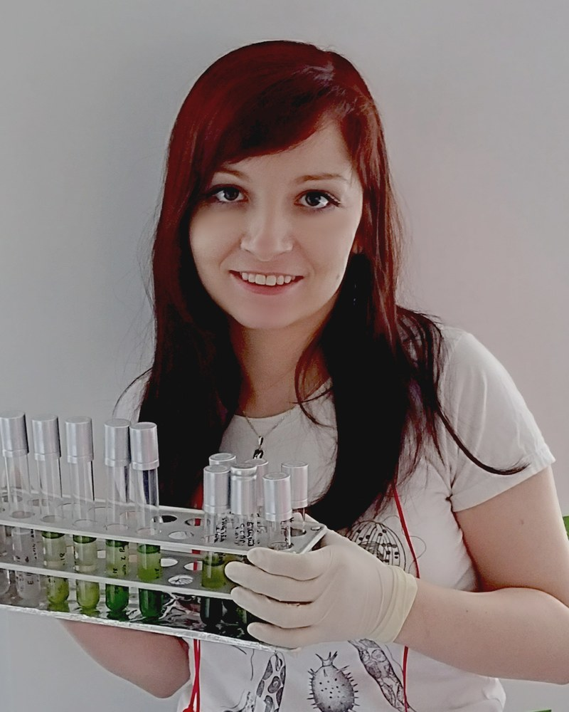

::: {.hero}
<div>
<span class="eyebrow">RNA biology · Research software · Data visualisation</span>

<h1 class="hero-title">Natalia Gumińska, PhD</h1>

<p class="hero-role">Postdoctoral researcher</p>

<p class="hero-affil">Laboratory of RNA Biology (ERA Chairs Group)<br>
International Institute of Molecular and Cell Biology, Warsaw</p>

<p class="hero-summary">
I study RNA tails: how long they are, what they are made of, and how to measure
both reliably. I wrote <a href="https://github.com/LRB-IIMCB/ninetails">ninetails</a>,
which finds the residues in a poly(A) tail that are not adenosine. Currently
finishing postgraduate studies in Python Data Science Engineering at Koźminski
University.
</p>

<div class="btn-row">
  <a class="btn-cta" href="software.qmd"><i class="bi bi-code-square"></i> Software</a>
  <a class="btn-ghost" href="publications/index.qmd"><i class="bi bi-journal-text"></i> Publications</a>
  <a class="btn-ghost" href="contact.qmd"><i class="bi bi-envelope"></i> Contact</a>
</div>

<ul class="hero-facts">
  <li><i class="bi bi-geo-alt"></i> Warsaw, Poland</li>
  <li><i class="bi bi-building"></i> IIMCB</li>
  <li><i class="bi bi-braces"></i> R · Python · SQL</li>
</ul>
</div>

<div>

```{=html}
<!-- Replace with a real photograph. A square or 4:5 JPEG at roughly 800px on
     the long edge is plenty; update the src and the alt text and nothing else
     needs to change. -->

```

</div>
:::

## What I do

::: {.card-grid}
::: {.u-card .reveal .d1}
<span class="card-icon"><i class="bi bi-eyedropper"></i></span>

### Research
Poly(A) tail dynamics and RNA metabolism, read off nanopore signal. Earlier work
on introns and circular DNA in euglenids.
:::

::: {.u-card .reveal .d2}
<span class="card-icon"><i class="bi bi-code-square"></i></span>

### Software
R packages for long-read analysis, a deep-learning classifier for tail
composition, and the laboratory's sequencing metadata databases.
:::

::: {.u-card .reveal .d3}
<span class="card-icon"><i class="bi bi-easel"></i></span>

### Graphic design
Figures, schematics and graphical abstracts, and the visual identification of
the [DEGRONOPEDIA](https://degronopedia.com/) web server. I also draw for my
Facebook page, [Biorysunki](https://www.facebook.com/biorysunki).
:::
:::

## Interests

::: {.card-grid}
::: {.u-card .reveal .d1}
<span class="card-icon"><i class="bi bi-brush"></i></span>

#### Digital art
Character and creature work, mostly fantasy. Gallery on the
[Illustrations](illustrations/index.qmd) page.
:::

::: {.u-card .reveal .d2}
<span class="card-icon"><i class="bi bi-dice-5"></i></span>

#### Music, games and fantasy
I am a metalhead obsessed with fantasy worlds and gaming. Outside work you can
find me playing *Guild Wars 2* or *Kingdom Come: Deliverance*.
:::
:::

## Working together

::: {.highlight-box .reveal}
If you are interested in collaborating on a scientific project, or need
scientific illustration work, [get in touch](contact.qmd).
:::

::: {.btn-row}
<a class="btn-cta" href="contact.qmd"><i class="bi bi-envelope"></i> Contact</a>
<a class="btn-ghost" href="software.qmd"><i class="bi bi-code-square"></i> Software</a>
<a class="btn-ghost" href="illustrations/index.qmd"><i class="bi bi-easel"></i> Illustrations</a>
:::
