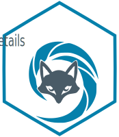
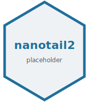
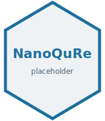

::: {.lead .reveal}
R packages for nanopore direct RNA sequencing, and the databases that keep
laboratory data usable. Most of it is open source under
[LRB-IIMCB](https://github.com/LRB-IIMCB), with personal projects on
[my GitHub](https://github.com/nemitheasura).
:::

## Packages

```{=html}
<!-- One row per package. To swap in a real logo, replace the file in
     assets/img/logos/ keeping the filename, or point src at a new one. Hex
     stickers are 1.155:1; the slot is sized for that ratio but will accept
     any aspect. Raster logos are best at roughly 400px on the long edge. -->
<div class="sw-list reveal">

  <article class="sw-row">
    <div class="sw-logo">
      
    </div>
    <div class="sw-body">
      <h3 class="sw-name">ninetails <span class="status-badge status-active">author</span></h3>
      <p class="sw-desc">Detects non-adenosine residues in poly(A) tails from
      Oxford Nanopore direct RNA reads, using a convolutional network on
      signal-derived images. Published in <em>Nature Communications</em> (2025).</p>
      <p class="sw-meta">R, Nanopore, deep learning, signal analysis</p>
      <p class="sw-links">
        <a class="btn-ghost" href="https://github.com/LRB-IIMCB/ninetails" target="_blank">Repository</a>
        <a class="btn-ghost" href="https://lrb-iimcb.github.io/ninetails/" target="_blank">Documentation</a>
        <a class="btn-ghost" href="https://doi.org/10.1038/s41467-025-57787-6" target="_blank">Paper</a>
      </p>
    </div>
  </article>

  <article class="sw-row">
    <div class="sw-logo">
      
    </div>
    <div class="sw-body">
      <h3 class="sw-name">nanotail2 <span class="status-badge status-active">author</span></h3>
      <p class="sw-desc">Poly(A) tail length analysis: distributions,
      comparisons between conditions, and publication figures.</p>
      <p class="sw-meta">R, poly(A), statistics, visualisation</p>
      <p class="sw-links">
        <a class="btn-ghost" href="https://github.com/LRB-IIMCB" target="_blank">Organisation</a>
      </p>
    </div>
  </article>

  <article class="sw-row">
    <div class="sw-logo">
      
    </div>
    <div class="sw-body">
      <h3 class="sw-name">NanoQuRe <span class="status-badge status-maintained">contributor</span></h3>
      <p class="sw-desc">Quality control reports for nanopore sequencing
      runs.</p>
      <p class="sw-meta">R, quality control, reporting</p>
      <p class="sw-links">
        <a class="btn-ghost" href="https://github.com/LRB-IIMCB/NanoQuRe" target="_blank">Repository</a>
      </p>
    </div>
  </article>

  <article class="sw-row">
    <!-- rDNAmine has no hex logo. The slot is kept empty so the text in
         this row stays aligned with the rows above and below. -->
    <div class="sw-logo"></div>
    <div class="sw-body">
      <h3 class="sw-name">rDNAmine <span class="status-badge status-active">co-author</span></h3>
      <p class="sw-desc">Analysis of long repetitive rDNA sequences in Oxford
      Nanopore reads. Described in <em>Yeast</em> (2026).</p>
      <p class="sw-meta">Shell, long reads, rDNA</p>
      <p class="sw-links">
        <a class="btn-ghost" href="https://github.com/LRB-IIMCB/rDNA_mine" target="_blank">Repository</a>
        <a class="btn-ghost" href="https://doi.org/10.1002/yea.70023" target="_blank">Paper</a>
      </p>
    </div>
  </article>

</div>
```

## Laboratory data infrastructure

Relational schemas for samples, libraries, sequencing runs and their metadata,
with role-based access and an audit trail. Built and maintained for the
laboratory rather than released publicly.

::: {.btn-row}
<a class="btn-cta" href="publications/index.qmd"><i class="bi bi-journal-text"></i> Publications</a>
<a class="btn-ghost" href="stack.qmd"><i class="bi bi-braces"></i> Stack</a>
<a class="btn-ghost" href="https://github.com/nemitheasura" target="_blank"><i class="bi bi-github"></i> GitHub</a>
:::
